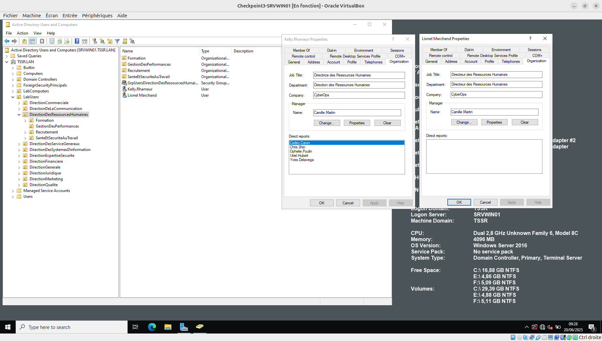

# Exercice 1 : Manipulations pratiques sur VM Windows  

## Partie 1 : Gestion des utilisateurs  
### Q.1.1.1  

### Q.1.1.2  
### Q.1.1.3  
### Q.1.1.4  

## Partie 2 : Restriction utilisateurs  
### Q.1.2.1  
### Q.1.2.2  
### Q.1.2.3  

## Partie 3 : Lecteurs réseaux  
### Q.1.3.1  
